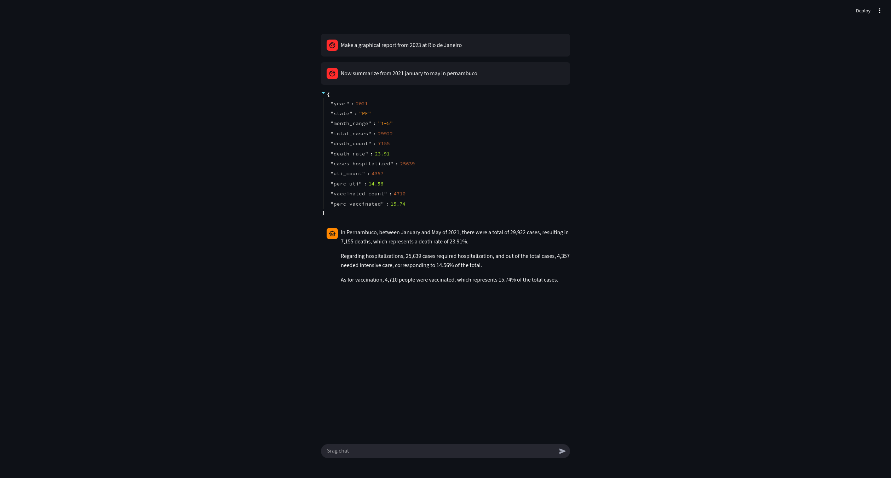
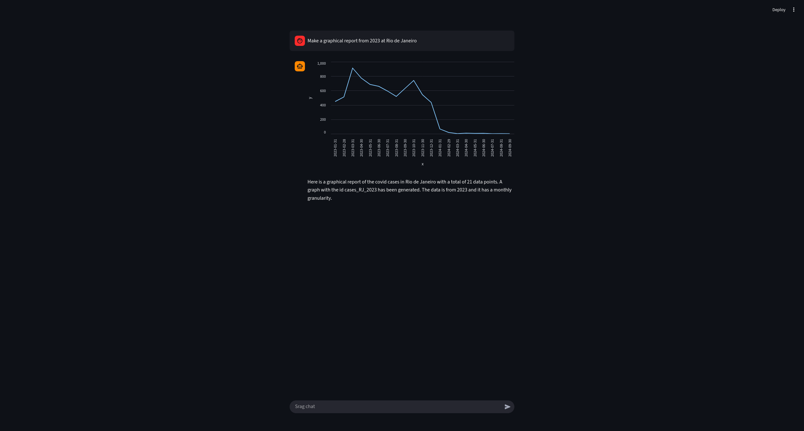

# How to run this branch

You need docker and docker compose installed, add your google api key from google ai studio [google-ai](https://aistudio.google.com/api-keys) in a .env file with the .env.setup structure at root dir then run the following command at the root directory.

```
make
```

it will build and run if you want it to run again only run

```
make run
```

and stop

```
make stop
```

the dashboard will run on [streamlit](http://localhost:8501) and the backand at [fastapi](http://localhost:8000)

# DataSus conversational agent

## Disclaimer

1) The architectures shown in this readme are also uploaded as pdfs within the root of the repository the files are 'main_archtecture.pdf' and 'api_archtecture.pdf'

---

This agent consists on using a React agent, the reason being that the agent gets the prompt
and reflects about what was prompted. This project was made using langchain and langgraph at the other 
branches it adds up the complexity.

- The main one is a simple streamlit running the agent locally. 
- The second one adds an api abstraction to show how to protect your ip from your clients
- The third one adds up for the scalability sake, it shows how to scale things with docker

I would implement a fourth one where the prompt was sent to an api but due to computational restraints
i let go of doing this one.

the dashboard will run at [localhost](http://localhost:8501)

## How its tools work

1) The first tool is a tool that summarizes frequency and median of possible values from the data extraction based on prompted columns
2) The second tool makes a statistical report from a year time window, january to december from 2022 for example. and also the state you desire
3) The third tool gets data points so it can create a chart at streamlit

## Example of conversations

Usage of the summarization tool


Usage of statistical report tool


Usage of chart report


## Decisions about the data

I've made the decision to work with the following columns for the sake of chatting about the data.

```
EVOLUCAO, UTI, DT_NOTIFIC, SG_UF_NOT, VACINA_COV, HOSPITAL, SEM_NOT 
```
These columns are enough to track the pacient, since it has the info about the hospital and how 
he reacted to the treatment even if he wen to the UTI or die. I've exclude data like cpf and 
location data for the sake of being neutral and not bringing bias to the model

## Statistics asked

The agent answers and with a tool that calculates the following:
- Rate of increasing infections from period of time
- Mortality rate
- UTI ocupation rate
- Population that got vaccinated

## The agent

The agent here has in total 3 tools

- summarize_numerical_data -> Summarize the categorical data from the csv collumns 
- generate_statistical_report -> Creates a dataframe with informations about selected period of time 
- generate_temporal_graphical_report -> Creates a graph about the count of infections

This time i opted in using gemini-2.5-pro so it doesn't take much of my computer and use the gemini servers

## Architecture (Main Branch)

I've chosen a simple one for the time that i had available


This react agent has only one interpreter that will tell the agent the tool to call, it will get the
prompt via streamlit and if returned a graph it will plot the graph + the message, the agent always

## Code decisions

### Logger:

i've implemented a logger that gets inherited by all other classes so it gets easier to log what is
happening throughout the code. Called a facade pattern. This pattern is known as facade for a more complex
system without giving too much control but it can end up having a god item

### File structures:

The files has this pattern of src and streamlit for the reason that i can create the code as packages
making it easier to import the file wherever my file is since i have the path ensured. the init files
enforce that this patterns goes onra realizar essa tarefa.


### Code:

OOP is the most organized structure for a project not to be exclusive but it is preferrable since it 
handles variables really well all over the code.

### Tool usage:

The tools are fundamental to the agents, i didn't implement MCP because it would be an overkill since im 
not exposing to the web.

### Guardrails

I've enforced input validation layers for each tool call, not only i've enforced that also i've placed
business logic so that the code doesnt keep breaking with bugs from halucinations from the llm

## Why didn't i use Vectorial database?

It seems a bit obvious that it should use, but the scope here is much smaller, since tabular data
answers really well our task it seemed a bit of overengineering to use it, i could`ve made it to
retrieve past answers and use less tokens but due the short amount of time i have opted to not use it
