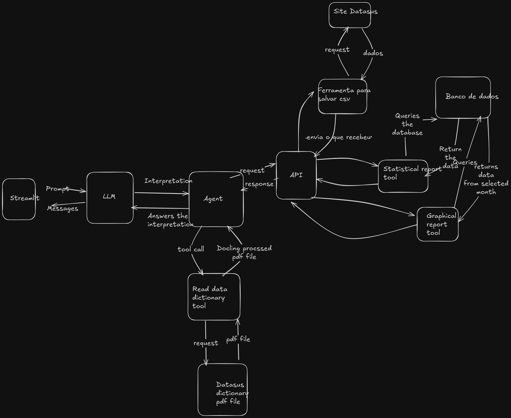

# DataSus conversational agent

This agent consists on using a React agent, the reason being that the agent gets the prompt
and reflects about what was prompted. This project was made using langchain and langgraph at the other 
branches it adds up the complexity.

- The main one is a simple streamlit running the agent locally. 
- The second one adds an api abstraction to show how to protect your ip from your clients
- The third one adds up for the scalability sake, it shows how to scale things with docker

I would implement a fourth one where the prompt was sent to an api but due to computational restraints
i let go of doing this one.

## Decisions about the data

I've made the decision to work with the following columns for the sake of chatting about the data.

```
EVOLUCAO, UTI, DT_NOTIFIC, SG_UF_NOT, VACINA_COV, HOSPITAL, SEM_NOT 
```
These columns are enough to track the pacient, since it has the info about the hospital and how 
he reacted to the treatment even if he wen to the UTI or die. I've exclude data like cpf and 
location data for the sake of being neutral and not bringing bias to the model

## Statistics asked

The agent answers and with a tool that calculates the following:
- Rate of increasing infections from period of time
- Mortality rate
- UTI ocupation rate
- Population that got vaccinated

## The agent

The agent here has in total 5 tools

- store_csvs -> This tool focuses on fetching the csv from the datasus website and store at the db
- get_data_dict -> Gets the data dictionary from the website 
- summarize_numerical_data -> Summarize the categorical data from the csv collumns 
- generate_statistical_report -> Creates a dataframe with informations about selected period of time 
- generate_temporal_graphical_report -> Creates a graph about the count of infections

I've opted to use a SLM to check its boundaries im using qwen2.5:14b, 
i've checked out and SLMs fine tuned for these tasks
are optimal for following structure, if i had more time i would implement a LLM to monitor the SLMs
to have a orchestrator of agents (multi agent system). 

## Architecture (Main Branch)

I've chosen a simple one for the time that i had available


This react agent has only one interpreter that will tell the agent the tool to call, it will get the
prompt via streamlit and if returned a graph it will plot the graph + the message, the agent always

## Architecture from other branches

This one i've made a small change but i wish i could invert how i did i would send the prompt via api
for the fourth branch because it will protect our data with guardrails and wont let users jailbreak it.
This branch i have the vision to show that i know how to create apis protecting the company ip



I've made the decision to let the dictionary reader run locally for one reason. It depends on gpus,
so based on this fact the api host isnt designed for such operation so it will be better to keep local.
the third branch actually has a small difference because it runs on docker, running on docker it lets us
scale and run on kubernetes later on and being on docker lets us run on a aws/gcp/azure service like ecs,
lambda, etc...

## Code decisions

### Logger:

i've implemented a logger that gets inherited by all other classes so it gets easier to log what is
happening throughout the code.

### File structures:

The files has this pattern of src and streamlit for the reason that i can create the code as packages
making it easier to import the file wherever my file is since i have the path ensured. the init files
enforce that this patterns goes on

### Code:

OOP is the most organized structure for a project not to be exclusive but it is preferrable since it 
handles variables really well all over the code.

### Tool usage:

The tools are fundamental to the agents, i didn't implement MCP because it would be an overkill since im 
not exposing to the web.

### Guardrails

I've enforced input validation layers for each tool call, not only i've enforced that also i've placed
business logic so that the code doesnt keep breaking with bugs from halucinations from the llm

## Why didn't i use Vectorial database?

It seems a bit obvious that it should use, but the scope here is much smaller, since tabular data
answers really well our task it seemed a bit of overengineering to use it